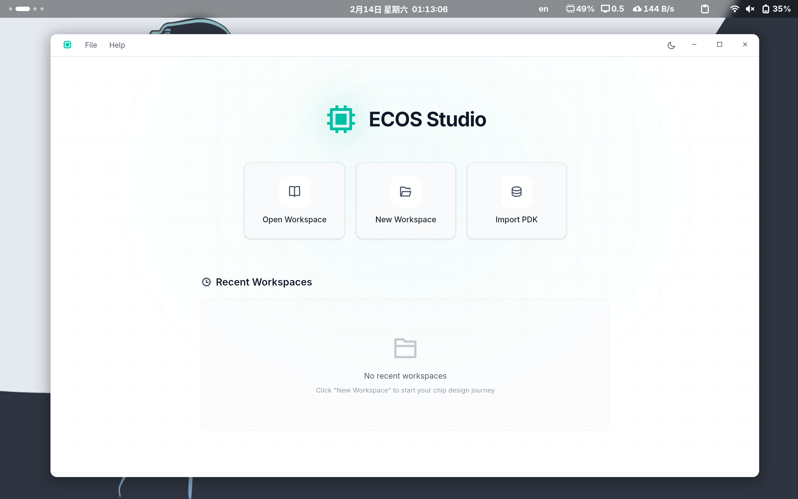

# ECOS Studio

ECOS Studio is a desktop application that provides an integrated development environment for chip design, guiding you through the complete RTL-to-GDS flow.

<div align="center">
<picture>
  <source media="(prefers-color-scheme: dark)" srcset="docs/asset/overview-dark.png">
  <source media="(prefers-color-scheme: light)" srcset="docs/asset/overview-light.png">
  
</picture>
</div>

## Download

- [ECOS-Studio v0.1.0-alpha.2 AppImage (amd64)](https://github.com/openecos-projects/ecos-studio/releases/download/v0.1.0-alpha.2/ECOS-Studio_0.1.0_amd64.AppImage)

## Quick Start (For Developers)

### Development

```bash
# From repo root — one-time setup (submodules, PDK, DreamPlace .so, ECC-Tools)
make setup

# Install dev dependencies and create symlinks
make dev

# Run GUI in dev mode
cd ecos/gui && pnpm tauri dev
```

### DreamPlace Development

DreamPlace C++ operators are compiled by Bazel and installed as `.so` files into the source tree for venv-based development:

```bash
cd ecc
bazel run //bazel/scripts:install_dreamplace    # Build + install .so files
bazel run //bazel/scripts:clean_dreamplace      # Remove installed artifacts (manifest-based)
```

### Release Wheels

Release builds download pinned GitHub Release wheels into `ecc/dist/wheel/repaired/`:

```bash
# Download pinned ecc, ecc-dreamplace, and ecc-tools release wheels
make _download_ecc_wheel _download_dreamplace_wheel _download_ecc_tools_wheel
```

### Release Build

`make build` runs the full pipeline:

```
download pinned release wheels → uv sync (runtime deps) → install wheels into venv → PyInstaller bundle → AppImage
```

```bash
# Full release build (from repo root)
make build

# Launch the built AppImage
make gui
```

The release wheels are installed as **non-editable** packages so that PyInstaller's `collect_all("dreamplace")` and `collect_all("chipcompiler")` can discover all package files during bundling.

## Documentation

- [User Guide](docs/user-guide.md) - Complete guide to using ECOS Studio
- [ECC Documentation](https://github.com/openecos-projects/ecc/blob/main/README.md) - ECC toolchain documentation

