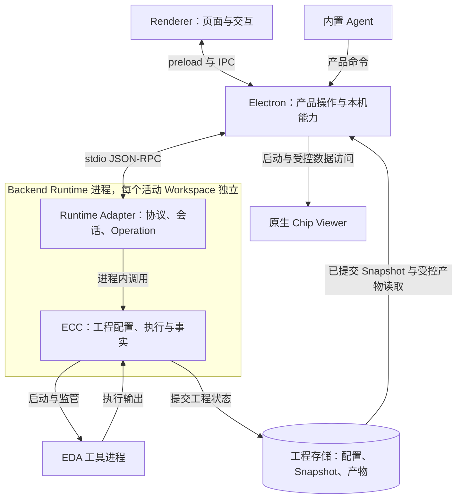
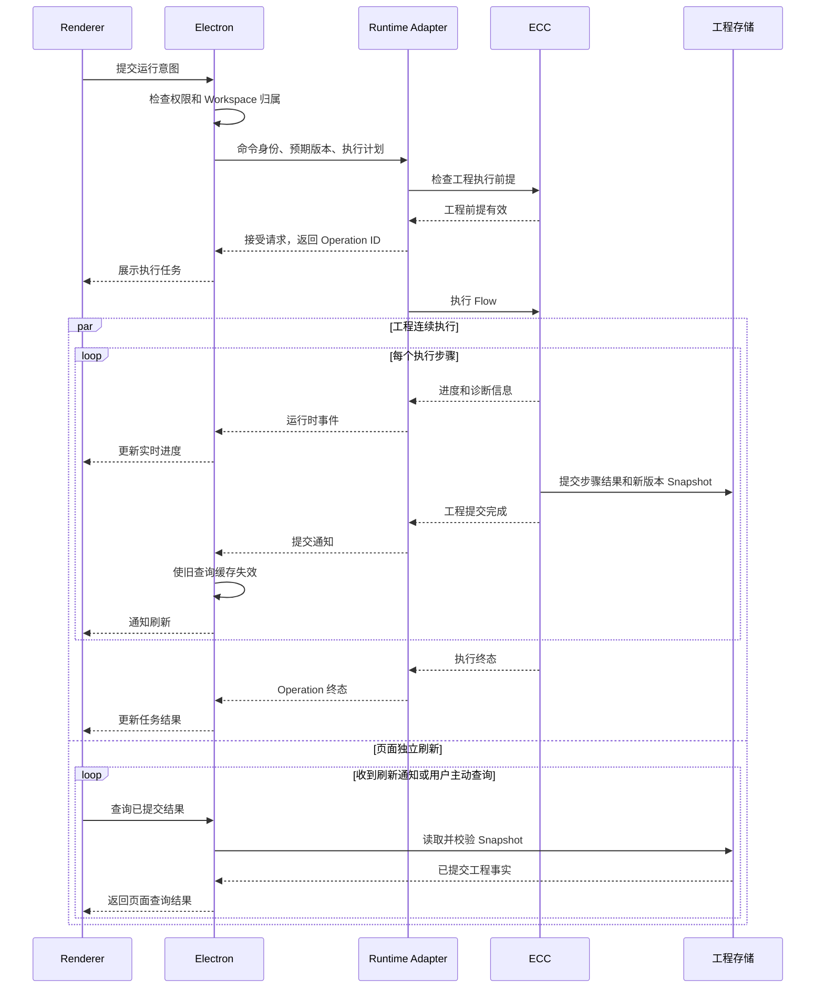

# ECOS Studio 后端系统架构

本文整理当前重构计划中的四层架构：ECC、ecos-runtime-adapter、Electron 和 Renderer。重点是每层负责什么，以及用户打开工程、修改配置、运行和查看结果时，系统怎样协作。

适用范围是 Backend 芯片后端工程。ECC-FE 的前端设计运行时继续按独立架构维护。文中的 Renderer 指桌面界面进程，与芯片设计中的 Frontend 不是同一个概念。

Project 是一个芯片设计及其实现方案的集合。每个 Workspace 是其中一个可以独立运行、比较的方案；Flow 是这个方案要执行的工程流程，由若干有顺序和依赖关系的步骤组成。后文将 ecos-runtime-adapter 简称为 Runtime Adapter，Electron 均指主进程。

## 1. 系统由谁负责什么

ECC 是工程事实来源。工程配置是否有效、Flow 怎样执行、某一步是否成功、结果质量如何，都由 ECC 判断并提交。Studio 使用这些结果组织用户的工作。

| 模块 | 负责的事情 | 交付给其他模块的内容 |
| --- | --- | --- |
| ECC | 工程配置、Flow 执行、工具监管、结果提交和工程分析 | 经过校验的配置、执行结果、Engineering Snapshot、工程产物 |
| Runtime Adapter | 将 ECC 接入 Studio，管理运行会话和长任务 | 可调用的运行时接口、Operation 状态、进度和日志事件 |
| Electron | 产品操作、工程组织、本机资源、权限、运行时进程和结果查询 | 页面所需的查询结果、操作反馈、受控的文件与原生能力 |
| Renderer | 用户界面、编辑草稿、导航和结果展示 | 用户操作意图，以及当前页面的交互状态 |

例如用户修改时钟周期，Renderer 保存编辑草稿，Electron 检查操作权限并提交请求，Adapter 将请求交给 ECC。ECC 校验参数、提交新配置，并决定已有结果怎样失效。界面随后显示提交结果。

### 进程之间的关系

Renderer 和 Electron 是不同进程。Renderer 通过受限的 preload 桥接接口使用桌面能力，Electron 接收 IPC 请求后执行权限检查。

Runtime Adapter 是 Electron 启动的 Python 运行时。ECC 工程模块加载在这个运行时进程内，Adapter 通过 Python 接口调用它；ECC 再启动实际的 EDA 工具进程。Adapter 替换原有的 ECC RPC 服务进程，整个调用链不会因此额外串入一个 ECC 服务进程。

ECC CLI 在自己的进程中直接调用同一套 ECC 工程模块。因此，一个由 Studio 创建的工程可以交给 CLI 继续处理，CLI 创建的工程也可以在 Studio 中打开。两种入口共享工程规则和持久化格式。

## 2. ECC：定义、执行并提交工程事实

ECC 负责一个工程在脱离界面后仍然能够正确运行。它掌握工程配置的含义、步骤之间的依赖、工具执行结果，以及产物对应的工程版本。

### 工程配置与可移植性

创建或更新 Workspace 时，ECC 接收工程意图和本机资源绑定。工程意图包括设计输入、PDK 要求、Flow 和参数；资源绑定告诉 ECC，这次调用应从当前电脑的哪些位置取得输入和工艺资源。

ECC 校验输入是否完整、参数是否有效、PDK 是否匹配，并解析默认值。通过校验后，它保存 Workspace Descriptor，也就是这个方案当前生效的工程配置。Studio 和 CLI 都以它为准。

工程配置与本机资源位置分开保存。移动工程或换一台电脑时，工程含义保持不变，新环境需要重新提供符合要求的资源绑定。缺少执行资源时，已经提交的历史结果仍可查看，重新运行则要等资源校验通过。

ECC 也负责参数更新后的失效范围。影响整个 Workspace 的参数变更会让原有工程结果整体过期；经 ECC 确认只由单个步骤消费的 Step Option，可以只使该步骤及其下游结果过期。

### Flow 执行和工具监管

ECC 根据 Flow 定义决定步骤顺序、输入输出依赖，以及 Run、Rerun 和单步执行的工程行为。它负责启动 EDA 工具、观察退出码和信号、收集诊断信息，并在允许的位置处理取消请求。

一个步骤留下了输出文件，不能据此认定执行成功。ECC 必须确认工具结果和声明输出，再提交该步骤的结果。工具崩溃或输出不完整时，失败状态也要有明确记录。

步骤提交完成后，Flow 可以继续推进。用户是否打开这个 Workspace、页面是否画完图，都不会成为下一步执行的条件。

### 工程结果和分析

ECC 为已提交的工程状态维护 Workspace Revision，并生成该版本的 Engineering Snapshot。Snapshot 是结构化结果快照，包含 Flow 状态、指标、Checklist、QoR 质量评估、Signoff 签核评估和产物引用。

Workspace 页面与项目比较页面使用同一份单 Workspace 评估。例如某个 Workspace 的 QoR 分数由 ECC 计算，两个页面应得到同一个值。Electron 可以比较多个 Workspace 的分数、计算差值和组织推荐，不能为同一个 Workspace 再计算一套分数。

日志正文、DEF、GDS 和完整版图数据保存在产物中。Snapshot 记录这些产物的身份、所属步骤和必要的校验信息，供 Electron 按需读取。

### Project 和 Workspace 的持久化一致性

ECC 还拥有 Project Manifest 的统一校验和写入规则。Manifest 记录 Project 身份、Workspace 成员关系、派生关系、归档状态，以及 baseline 等明确的项目选择。

用户选择哪个 baseline，由 Studio 的产品交互决定；这个选择怎样写入可移植的 Project 文件，由 ECC 的 Project 能力负责。这样，CLI 和 Studio 可以继续使用对方创建的 Project。

Manifest 不保存 Workspace 的 Flow 执行结果或 QoR 摘要。这些内容随工程运行变化，应从 Engineering Snapshot 取得。创建一个受 Project 管理的 Workspace 时，ECC 负责工程目录、配置、初始 Snapshot 和 Manifest 登记的一致提交。

## 3. Runtime Adapter：让 Studio 能调用和跟踪 ECC

一次工程执行可能持续很久。Studio 需要先知道请求是否接受，再持续获得进度，允许用户取消，并在断线后查询最终结果。Runtime Adapter 负责这套运行时行为。

### 协议和会话

Adapter 接收 Electron 发来的 JSON-RPC 请求，检查协议结构，将输入转换成 ECC 所需的参数，并把 ECC 返回的结果或错误转换成运行时响应。

打开 Workspace 运行会话后，Adapter 分配一个临时 Workspace Handle。Electron 后续使用这个 Handle 指向对应会话。Handle 在会话结束或 Adapter 重启后失效；工程自身的 Workspace ID 则由 ECC 持久化，重新打开时继续使用。

Adapter 拥有协议和会话信息。工程文件怎样解释、配置是否有效、步骤依赖是否满足，仍由 ECC 的接口作出判断。

### Operation：一次执行任务的生命周期

用户发起一次 Run 或 Rerun，Adapter 就用一个 Operation 跟踪这次执行。它可以覆盖整个 Flow，也可以只执行一个指定步骤。

Operation 的状态包括 `queued`、`running`、`succeeded`、`failed`、`cancelled` 和 `interrupted`。`queued` 表示已经接受、尚未开始执行的短暂状态；同一个 Workspace 已有活动任务时，第二个执行请求会直接冲突，系统不把它排进等待队列。

Adapter 记录 Operation ID、当前步骤、取消意图和终态，并根据命令身份处理重复请求。相同命令身份和相同输入再次提交时，返回原有结果；相同身份带着不同输入时，返回冲突，防止重试意外产生第二次执行。

点击取消后，Adapter 先记录取消请求，再交给 ECC 处理。界面可以显示正在取消，但只有 ECC 确认已经安全停止，Operation 才能进入 `cancelled`。已经提交的执行终态不会因为一个迟到的取消请求而改变。

### 事件和恢复

Adapter 将 ECC 的执行进度、日志和提交结果整理为 Studio 的运行时事件。进度事件用于实时显示，提交事件用于提醒 Electron 重新读取工程结果。

运行时事件允许延迟、重复或丢失。恢复连接时，Electron 查询 Operation 状态和已提交 Snapshot，恢复任务与工程结果的展示。

Adapter 重启后，需要核对持久化的任务记录和 ECC 已提交结果。无法确认终态的活动任务标记为 `interrupted`。如果恢复需要修改工程状态，Adapter 应调用 ECC 的恢复能力，由 ECC 决定并提交相应工程结果。

## 4. Electron：组织产品操作和本机能力

Electron main 是桌面应用的协调者。它知道哪个窗口正在使用哪个 Project、用户授权了哪些路径、哪些 Workspace 正在运行，以及哪些结果应交给当前页面。

### 产品命令与权限

Renderer 将用户意图提交给 Electron，例如创建 Workspace、运行 Flow、修改配置或导出签核包。Electron 检查窗口和 Workspace 的归属，验证输入与路径权限，并执行产品要求的确认流程。

内置 Agent 使用同一组产品命令。它可以提出参数修改或运行请求，但仍要经过 Electron 的授权和确认策略。Agent 不能通过直接调用 ECC 或 Adapter 绕开这些产品规则。

校验分两层完成：Electron 检查这次操作是否被允许，ECC 检查这项工程变更是否成立。Renderer 中的输入检查主要帮助用户及时发现问题，不能代替这两层检查。

### 项目组织与比较

Electron 组织项目管理、Workspace 派生与归档、baseline 选择、跨 Workspace 比较，以及排序和推荐。

它从各 Workspace 的 Snapshot 取得工程事实，再结合项目关系形成产品结果。例如比较某个方案相对 baseline 的面积和时序变化，或说明哪个方案更符合当前项目目标。

Project Manifest 的工程文件读写通过 ECC 完成。最近使用记录、窗口归属、创建过程的应用登记和恢复提示由 Electron 维护。工程创建已经成功、最近使用列表登记却失败时，工程文件保留，Electron 只需补完应用登记。

### 查询结果与刷新

Electron 将工程事实组织成 Workspace Overview、Step Detail、Project Comparison 等页面查询结果。这里的查询结果也称 ReadModel，包含产品场景需要的数据和可用性信息。

查看已提交结果时，Electron 直接读取并校验持久化的 Engineering Snapshot。它检查 Workspace 身份、版本和结构，再组成页面数据。历史结果查询不需要为目标 Workspace 创建运行会话。

配置查询有不同的要求：ECC 需要解释当前有效参数、工具默认值和 Step Options。Electron 因此调用 ECC 的配置读取能力，再返回适合编辑器使用的结果。这类读取保持只读，不创建执行 Operation。

Electron 负责查询缓存和失效通知。收到工程提交提示后，它先使旧查询缓存失效，再通知 Renderer 刷新。文件变更提示、主动刷新和恢复窗口焦点，也可以触发同一套重新查询流程。

### 进程、资源和产物访问

Electron 按需启动和监管 Runtime Adapter。不同 Workspace 的活动执行使用独立运行时，某个 Workspace 的页面切换不会决定其运行时是否退出。

Electron 还负责 PDK 与工具资源的本机安装和定位，将解析出的本机资源绑定交给 ECC 校验。原生 Chip Viewer 的启动与管理也由 Electron 完成。

Renderer 请求查看产物时，Electron 根据已授权 Workspace 和产物引用定位内容，检查访问范围及声明的大小、哈希和版本。大日志按块读取或持续跟踪，大型布局数据通过专用读取和 Viewer 能力处理。

## 5. Renderer：让用户理解结果并发起下一步操作

Renderer 负责页面、导航、表单、图表、表格、筛选和本地化。它保存尚未提交的编辑草稿，接收 Electron 返回的数据，并让用户看清操作是否成功、结果是否过期、哪些内容暂时不可用。

Renderer 运行在隔离的界面环境中。文件读取、进程启动和原生能力都通过 Electron 提供的受限接口完成。

页面会同时持有以下几类状态：

| 页面状态 | 来源 | 用途 |
| --- | --- | --- |
| 已提交工程结果 | Electron 返回的 Snapshot 查询投影 | 展示 Flow 结果、指标、QoR、Checklist 和签核评估 |
| 瞬态执行状态 | Operation 查询及运行时事件 | 展示正在运行的步骤、进度、日志和取消过程 |
| 交互状态 | 当前用户操作 | 保存编辑草稿、选中项、展开状态、筛选条件和导航位置 |

例如布局步骤正在运行时，页面可以继续显示已经提交的综合结果，同时显示布局步骤的实时进度。实时进度不会把综合结果覆盖掉，也不能提前生成布局步骤的成功结果。

Renderer 可以格式化单位、生成图表序列、按用户选择排序和筛选。工程评分、依赖判断、结果有效性和签核准入结论由后端提供。Snapshot 缺失时，页面应显示明确的不可用原因，不能读原始文件再推测一次工程状态。

用户切换 Workspace 或连续刷新时，Renderer 需要丢弃已经不属于当前上下文的迟到响应。页面自己的请求序号只用于解决显示顺序，不代表工程版本。

## 6. 系统保存哪些数据

### 数据归属

| 数据 | 负责模块 | 保存与使用规则 |
| --- | --- | --- |
| Project Manifest | ECC 负责格式、校验和写入；Electron 发起产品选择 | 保存 Project 关系、生命周期和明确选择，不保存运行结果 |
| Workspace Descriptor | ECC | 保存当前已提交的可运行配置和可移植来源信息 |
| Workspace Spec | ECC 定义并校验；调用方构造 | 创建或更新时提交的工程意图，不额外保存成第二份配置 |
| Workspace Bindings | Electron 或 CLI 提供；ECC 校验 | 记录本次调用的本机资源位置，与可移植工程配置分开 |
| Flow 记录与 Engineering Snapshot | ECC | 保存已提交状态、分析结果和版本，作为工程结果查询依据 |
| 工程产物 | ECC 管理工程身份与有效性；Electron 提供受控内容访问 | 关联 Workspace、步骤和版本，大内容按需读取 |
| Operation 记录 | Runtime Adapter | 跟踪执行任务，支持状态查询、重复命令识别和中断恢复 |
| 创建日志与应用登记 | Electron | 处理窗口归属、退出协调、最近使用记录和应用侧恢复 |
| 查询缓存 | Electron | 减少重复读取，随工程提交或其他失效提示更新 |
| 编辑草稿和页面状态 | Renderer | 服务当前交互，提交成功后以返回的工程配置为准 |

这些数据的保存周期不同。关闭页面可以丢弃筛选条件，关闭运行会话会使 Handle 失效，但 Project 关系、工程配置和已提交结果仍然保留。

### 标识和版本

| 标识 | 表示什么 | 生命周期 |
| --- | --- | --- |
| Project Workspace ID | Workspace 在 Project 中的身份，用于成员关系、派生和 baseline | 随 Project 持久化 |
| Engineering Workspace ID | ECC 工程对象的稳定身份，用于关联工程结果和执行任务 | 随 Workspace 持久化，移动目录不改变身份 |
| Workspace Revision | 已提交工程状态的版本 | 由 ECC 在工程提交时推进 |
| Workspace Handle | Adapter 中的一次 Workspace 会话 | 会话关闭或 Adapter 重启后失效 |
| Operation ID | 一次长时间执行任务 | 用于查询和跟踪该任务 |
| Command ID | 一次命令的重试身份 | 同一命令重试时复用，输入变化则视为冲突 |
| Query generation | Electron 查询缓存的一次有效周期 | 缓存失效时变化，不改变工程版本 |

修改工程时，调用方携带预期 Workspace Revision。ECC 发现当前版本已经变化，就拒绝使用旧版本意图覆盖新状态。晚到的事件和页面刷新都不能自行推进这个版本。

## 7. 应用怎样运转

### 启动应用，打开 Project

Electron 启动后建立桌面能力、权限范围和进程监管，再创建 Renderer 窗口并注入 preload 接口。Renderer 加载页面，通过 Electron 获取最近使用记录、资源信息和项目数据。

用户打开 Project 时，Electron 取得经过 ECC 解释的 Manifest，并建立产品上下文。项目比较可以直接读取成员 Workspace 的已提交 Snapshot，无需逐个启动它们的运行时。

当用户进入某个 Workspace 的执行或编辑场景，Electron 按需准备对应运行时，通过 Adapter 调用 ECC 打开工程、校验资源绑定，并取得会话与执行就绪状态。已有活动会话可以继续复用。

### 创建 Workspace

1. Renderer 收集设计输入、PDK、Flow 和参数，保留用户填写的草稿。
2. Electron 检查目标位置和资源授权，构造 Workspace Spec 与本机 Bindings，并记录创建请求。
3. Adapter 调用 ECC。ECC 校验完整输入，在暂存区域构建工程，完成后提交配置、初始 Snapshot 和 Project 登记。
4. Electron 完成应用登记，Renderer 接收结果并更新页面。若用户已经导航到别处，创建完成通知不应强行改变当前页面。

创建过程可以在界面中显示为进行中，但工程创建本身是一次提交命令。只有持久化提交完成后才能报告创建成功，它不使用 Flow 执行 Operation 的生命周期。

### 运行 Flow

图中展示正常执行路径。ECC 提交步骤后即可继续后续执行，页面刷新与执行推进没有等待关系。请求被接受也只表示任务已创建，最终是否成功要等 ECC 的执行结果。

如果工程步骤执行成功，但某项可选分析数据缺失，界面可以同时显示执行成功和分析不可用。系统不会为缺失指标制造一个零值，也不会仅因某张图加载失败就把工程改判为失败。

### 查看历史结果和比较方案

用户进入 Workspace 概览或 Project Comparison，Renderer 向 Electron 请求结果。Electron 从已授权位置读取 ECC 的 Snapshot，检查身份和版本后生成查询结果。

项目比较逐个消费 Workspace 的单工程评估，再计算 baseline 差值、排序和推荐。对于正在运行的 Workspace，Electron 可以叠加当前 Operation 进度，但只有 Workspace 身份和版本匹配时才允许关联。

用户打开某条详细 Finding、日志或版图时，Electron 再按对应产物引用读取内容。普通概览查询不扫描整个工程目录，也不一次性载入所有报告和布局文件。

### 修改配置，查看旧结果，再重跑

配置编辑器查询目标 Workspace 当前最新的有效配置。页面上若同时显示上一版本的工程结果，需要分别标明配置版本和结果版本。

用户保存后，Electron 将修改交给 Adapter，ECC 校验预期版本和参数归属，提交新配置并处理结果失效。运行中的 Workspace 拒绝配置修改，避免执行输入中途变化。

| 修改方式 | ECC 的处理 | 用户能继续看到什么 |
| --- | --- | --- |
| Workspace Parameter 更新 | 提交新配置版本，使原工程结果整体过期 | 带过期标记的只读旧结果，以及最新配置 |
| Step Option 更新 | 保留前置步骤结果，使目标步骤和下游结果过期 | 仍有效的前置结果，以及失效步骤的只读旧结果 |
| 结构性 Workspace Update | 按完整工程替换处理，重新构建配置和工程内容 | 取决于用户是否选择保留原 Workspace 备份 |

结构性替换前，Studio 需要明确告知 Flow 状态、结果、日志和用户文件的替换范围，让用户选择保留原 Workspace 备份或永久删除原内容。Agent 不能替用户选择。

普通配置更新保留的旧结果只用于调查和对照，不能参与当前 QoR、签核、项目推荐或后续执行依赖。系统最多保留一份供过期步骤查看的旧 Snapshot；这些步骤都有新结果后，就释放这份旧快照。再次运行时，ECC 先提交重跑准备状态，再逐步用新结果替换过期结果。

旧 Snapshot 的结构化事实可以保留，原始产物没有独立的完整版本副本。某一步开始重跑准备、清理旧输出后，对应旧产物就可能不可用，页面需要明确显示这一状态。

### 切换 Workspace 和后台执行

一个窗口只展示一个前台 Workspace，但可以保留多个 Workspace 的运行会话。用户从 A 切换到 B，改变的是前台上下文；A 的活动 Operation 继续运行。

Electron 先准备 B 的候选上下文，确认打开成功后再切换。B 打开失败时，A 的页面上下文和运行任务仍然保留。再次切回 A 时，系统复用它的活动会话和 Operation。

后台任务只需要持续展示 Workspace 身份、当前步骤和任务状态。页面无需为了保住任务而在后台加载整套图表、日志和版图。后台任务结束后，Electron 确认最终 Snapshot 可读，再释放不再需要的会话。

### 导出签核包

Renderer 展示 ECC 当前的 Signoff Assessment。Electron 处理导出位置、路径授权和必要的用户确认，Adapter 接收导出请求后调用 ECC。

ECC 在实际导出前重新检查当前工程能否签核，再收集产物、校验完整性并生成归档包。之前打开过的签核对话框不能替代这次检查，某个固定步骤名称也不能代替 ECC 的签核判断。

### 关闭应用

Electron 汇总仍在运行的任务和尚未确认结果的创建请求，向用户展示退出影响。正常退出协调任务停止、最终结果读取和进程清理。

强制退出可能留下无法确认终态的 Operation 或未完成的应用登记。下次启动时，Adapter 恢复任务记录，ECC 提供已提交工程事实，Electron 呈现需要用户处理的恢复项。系统不能因为创建结果未知就自动删除工程目录。

## 8. 出错后各层怎样处理

| 情况 | 处理责任 | 用户应看到的结果 |
| --- | --- | --- |
| 参数非法、输入缺失或 PDK 不匹配 | ECC 返回明确的工程校验结果，Electron 和 Renderer 展示原因 | 变更未提交，或工程可以查看但暂时无法执行 |
| 同一 Workspace 重复执行 | Adapter 拒绝第二个活动 Operation；ECC 保留工程写入保护 | 已有任务继续运行，新请求提示冲突 |
| 工具异常退出 | ECC 记录失败步骤、退出原因和诊断，再通知 Adapter | Flow 或步骤失败，可查看对应诊断 |
| 用户请求取消 | Adapter 记录意图，ECC 在安全位置停止 | 先显示取消处理中，确认停止后显示已取消 |
| Adapter 意外退出 | Electron 观察进程退出；重启后 Adapter 对照任务记录与 ECC 结果恢复 | 无法确认结果的任务显示中断，已提交结果仍可查询 |
| 事件丢失或晚到 | Electron 重新查询 Operation 和 Snapshot，按身份及版本接受结果 | 页面能恢复，不依赖事件回放重建工程事实 |
| Snapshot 缺失或损坏 | Electron 返回明确的不可用原因 | 页面显示结果不可用，不推断为未开始或成功 |
| 产物缺失、越界或校验失败 | Electron 拒绝该次内容读取 | 对应详情不可用，其他有效结果仍可展示 |
| 请求基于旧版本 | ECC 拒绝过期工程修改，调用方重新读取 | 提示版本已变化，保留尚未提交的用户草稿 |
| 页面请求晚于 Workspace 切换返回 | Electron 和 Renderer 检查上下文及请求版本 | 旧响应不会覆盖当前 Workspace |
| 工程已创建，但应用登记失败 | Electron 保留工程提交结果并恢复应用登记 | 提示登记恢复，工程文件保留 |

## 9. 新功能由哪一层负责

| 新需求 | 应承担主要工作的模块 |
| --- | --- |
| 新增 EDA 步骤、参数校验、工程指标或签核规则 | ECC |
| 新增运行时命令、任务状态查询或事件投递行为 | Runtime Adapter |
| 新增项目比较方式、资源选择、权限策略或导出交互 | Electron |
| 新增图表、表格布局、筛选交互或编辑体验 | Renderer |

一个功能可以跨越四层。例如新增工程指标，由 ECC 定义和产出，Electron 将它纳入相应查询结果，Renderer 负责展示。只有需要新增运行时调用时，才扩展 Adapter 协议。

## 架构依据

- [Backend Runtime Architecture v1](../../docs/specs/backend-runtime-architecture-v1.md)
- [ECC Project and Workspace Contract Alignment](./specs/ecc-project-workspace-contract-alignment.md)
- [Backend 已提交工程事实 Snapshot-only 收敛](./specs/backend-committed-facts-snapshot-only-v1.zh-CN.md)
- [Workspace 配置更新保留过期结果](./adr/0039-configuration-updates-preserve-stale-results.md)
- [Backend Step Configuration Read Boundary](./specs/backend-step-configuration-read-boundary-v1.zh-CN.md)
- [前台 Workspace 与后台执行分离](../../docs/adr/0026-separate-foreground-workspace-from-runtime-execution.md)
