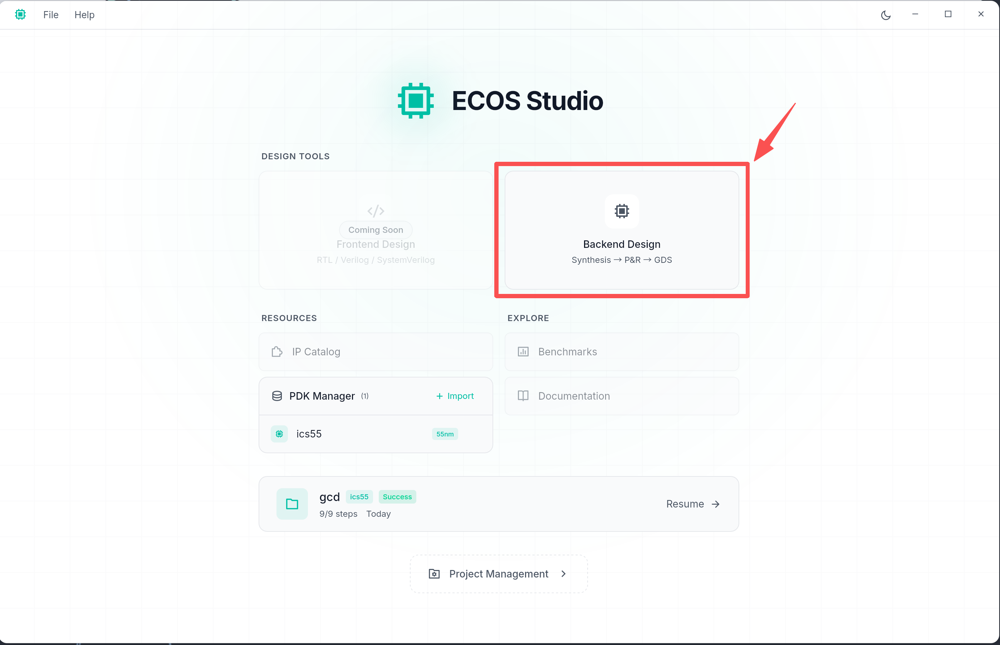
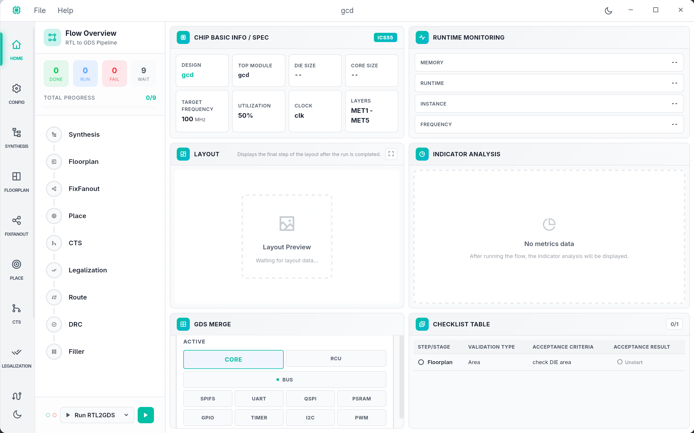
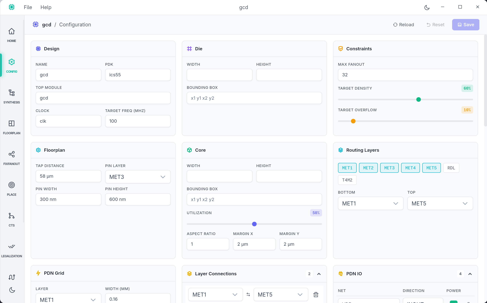
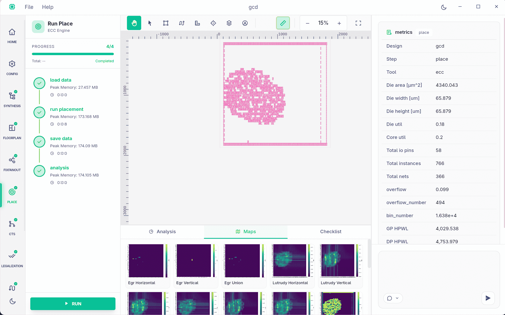
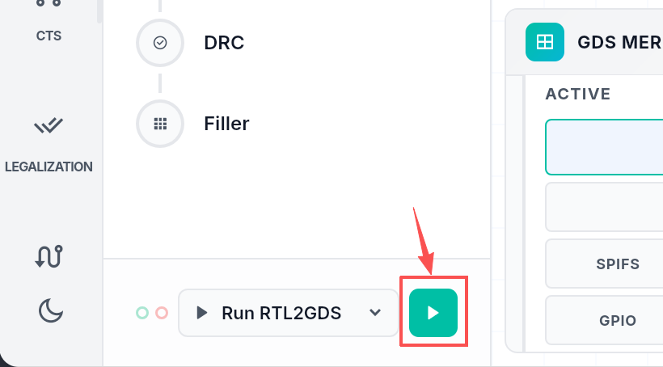
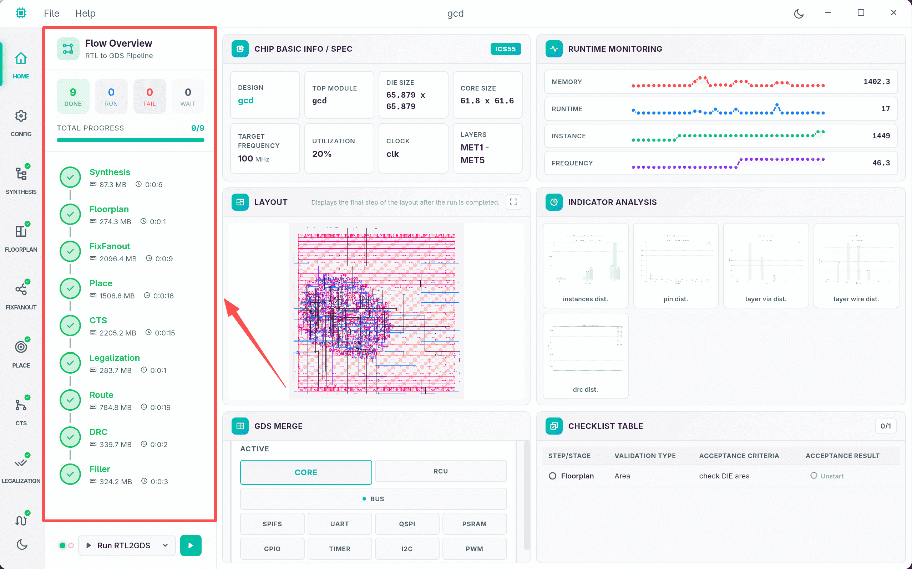
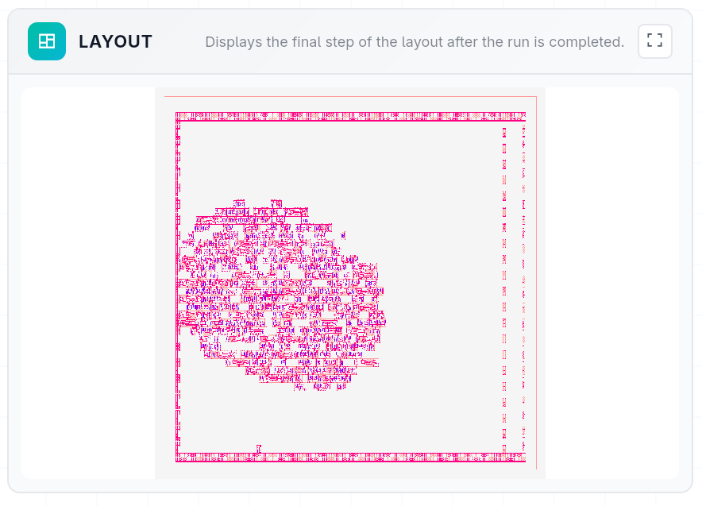
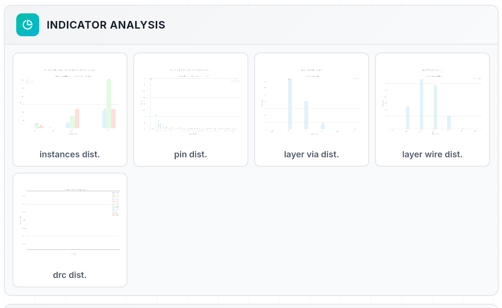

# ECOS Studio User Guide

This guide will walk you through using ECOS Studio to design and implement your chip from RTL to GDS.

## Table of Contents

- [ECOS Studio User Guide](#ecos-studio-user-guide)
  - [Table of Contents](#table-of-contents)
  - [Getting Started](#getting-started)
    - [Launching ECOS Studio](#launching-ecos-studio)
    - [Welcome Screen](#welcome-screen)
  - [Starting a Backend Design](#starting-a-backend-design)
  - [Creating a New Workspace](#creating-a-new-workspace)
    - [Step 1: Project Basics](#step-1-project-basics)
    - [Step 2: Design Files](#step-2-design-files)
    - [Step 3: Technology Setup](#step-3-technology-setup)
      - [PDK Selection](#pdk-selection)
      - [Design Parameters](#design-parameters)
    - [Step 4: Review \& Create](#step-4-review--create)
    - [Creating the Workspace](#creating-the-workspace)
  - [Workspace Overview](#workspace-overview)
  - [Workspace Pages](#workspace-pages)
    - [Home Page](#home-page)
    - [Configuration Page](#configuration-page)
    - [Step Editor Pages](#step-editor-pages)
  - [Running RTL-to-GDS Flow](#running-rtl-to-gds-flow)
    - [Starting the Flow](#starting-the-flow)
    - [Monitoring Progress](#monitoring-progress)
  - [Viewing Results](#viewing-results)
    - [Layout Visualization](#layout-visualization)
    - [Indicator Analysis](#indicator-analysis)
  - [Troubleshooting](#troubleshooting)
  - [Next Steps](#next-steps)

---

## Getting Started

### Launching ECOS Studio

**Linux (AppImage):**

> [AppImage](https://en.wikipedia.org/wiki/AppImage) is a portable Linux application format — download a single file, make it executable, and run it without installation. ECOS Studio is a GUI application and requires a desktop environment (X11 or Wayland) to run — it cannot be launched from a headless environment.

```bash
chmod +x ./ECOS-Studio_*.AppImage
./ECOS-Studio_*.AppImage
```

**From Nix:**
```bash
nix shell .#ecos-studio
ecos-studio
```

### Welcome Screen

When you first launch ECOS Studio, you'll see the welcome screen with options to:

**Design Tools:**

The home screen presents two design tool cards:

- **Frontend Design** *(Coming Soon)* - RTL / Verilog / SystemVerilog design entry (not yet available)
- **Backend Design** - The main chip implementation tool covering **Synthesis → P&R → GDS**. Click this card to enter the backend design environment.

**Resources:**

- **IP Catalog** *(Coming Soon)* - Browse reusable IP blocks
- **PDK Manager** - Manage your Process Design Kits

**Explore:**

- **Benchmarks** *(Coming Soon)* - Compare design metrics
- **Documentation** *(Coming Soon)* - Access guides and references

**Project Access:**

- **Continue Working:** a **Resume** Click it to quickly resume where you left off in your last project.
- **Project Management:** Click the **Project Management** button at the bottom to view and manage all your projects.

> [!NOTE]
> The **Frontend Design tool** and some **Resources** sections are still under development and will be available in future releases. Stay tuned for updates!
> You can try out the backend design flow with your own RTL files and the provided PDK to experience the core features of ECOS Studio.
>

<div align="center">
  
</div>
</br>

---

## Starting a Backend Design

After launching ECOS Studio, you'll see the home screen with the backend design card. Click on the **"Backend Design"** card to start creating your chip design project.

<div align="center">
  
</div>
</br>

## Creating a New Workspace

Click **New Workspace** to start the workspace wizard. The wizard guides you through 6 steps:

1. **Project Setup** - choose an existing project root or create a project root.
2. **Basic Info** - set the workspace name and confirm its directory.
3. **Flow Setup** - choose the harden flow range. The flow may start from any step (for example start at `place` with an existing `DEF` netlist pair); for a new workspace the Start Step selector lists every step, and clicking a step card sets the end of the range.
4. **Design Files** - provide RTL/filelist for synthesis starts, or `DEF` plus Verilog netlist for post-synthesis starts. `SDC` is configured here.
5. **PDK Config** - use ECC default PDK config or manually select technology LEF, cell LEF, and Liberty files.
6. **Spec Setting** - configure design, clock, die area, utilization, fanout, and related `parameters.json` fields.

When the wizard is opened from Project Management, the workspace path defaults to:

```text
<project_root>/<workspace_name>
```

You can still use the existing Browse action to choose a different location when needed.

### Creating From a Step Output

Project Management can create a new workspace from an existing workspace step output. For example, selecting `Floorplan` in `/workspaces/gcd_project/ics55_gcd_harden` and creating `ws_001` will prefill the wizard with the source project, source workspace, source step, and selected output files.

In this derived flow:

- **New Workspace** shows where the workspace comes from: project, source workspace, and source step.
- **Flow Setup** starts from the next runnable step. For a `Floorplan` source, the new workspace starts at `place`; `Synthesis` and `Floorplan` are shown as reused and cannot be selected, and the Start Step stays pinned to the source output step.
- **Design Files** reuses the source workspace data. `DEF` comes from the selected step output, while Verilog and `SDC` default to the source workspace configuration.
- **PDK Config** defaults to the source workspace PDK selection, including tech LEF, cell LEF, Liberty, or ECC default PDK configuration.
- **Spec Setting** defaults to the source workspace parameters.

---

### Creating the Workspace

After completing all steps:

1. Review your configuration summary
2. Click **"Create Workspace"**
3. ECOS Studio will:
   - Create the workspace directory structure
   - Generate configuration files from the wizard state
   - Reuse source step artifacts when the workspace is derived
   - Register the workspace in the current project `project.json` when launched from Project Management
   - Initialize workspace database

---

## Workspace Overview

## Workspace Pages

The workspace interface contains multiple pages accessible from the left sidebar navigation:

### Home Page

The Home page provides an overview of your project status and key metrics:

<div align="center">
  
</div>
</br>

**What you'll see:**

**Checklist Table**
- Shows completion status of all flow steps
- ✅ Success / 🔵 Running / ⚪ Pending / ❌ Failed
- Click on any step to view logs

**Runtime monitoring**
- Real-time visualization of flow progress
- Shows memory, runtime, instance, and frequency metrics
- Updates automatically as flow runs

**Layout Preview**
- Visual preview of current layout
- Use mouse wheel to zoom
- Middle-click and drag to pan
- Click fullscreen icon for expanded view

**Indicator Analysis**
- Metric charts from flow execution
- Click any chart for full-screen view
- Shows instance, layer, pin, DRC distributions and CTS skew map

**GDS Merge**
- Final layout merge preview
- Shows complete chip layout

---

### Configuration Page

Modify design parameters and flow settings:

<div align="center">
  
</div>
</br>

**What you can configure:**

**Basic Parameters**
- Design name, top module, clock signal
- Clock frequency target

**Core Settings**
- Die size (width × height)
- Core utilization percentage
- Core margins

**Placement Settings**
- Target density
- Target overflow
- Max fanout

**Floorplan Tracks**
- Routing track specifications
- Add/remove tracks as needed

**PDN (Power Distribution Network)**
- Power/ground pin assignments
- Power stripe specifications
- Layer connections

**How to save changes:**
1. Modify any parameters
2. Click **Save** button
3. Changes marked with * in title bar
4. Click **Reset** to undo unsaved changes

**Note:** Some changes require re-running affected flow steps.

---

### Step Editor Pages

Each flow step (Synthesis, Placement, Routing, etc.) has its own editor page:

<div align="center">
  
</div>
</br>

**Main Canvas (Left)**
- View and inspect your layout
- Mouse wheel to zoom
- Middle-click and drag to pan
- Left-click to select objects
- Use ruler tool for measurements

**Thumbnail Gallery (Bottom Left)**
- Quick preview of layout snapshots
- Click thumbnail to view that layout state
- Shows layout evolution across steps

**Right Panel**
- **Chat Tab** - Ask questions about your design
- **Inspector Tab** - View selected object properties

---

## Running RTL-to-GDS Flow

### Starting the Flow

Click **"Run"** button in the **Home Page** (Near the RTL2GDS Flow)

<div align="center">
  
</div>

### Monitoring Progress

<div align="center">

</div>

**Flow Status Indicators:**
- Each step shows real-time status
- Progress bar indicates completion percentage
- Estimated time remaining displayed

**Viewing Logs:**
1. Click on a running/completed step
2. View detailed logs in the left sidebar
3. Filter by log level (Info, Warning, Error)

---

## Viewing Results

### Layout Visualization

**Canvas Controls:**
- **Mouse Wheel** - Zoom in/out
- **Middle Click + Drag** - Pan view
- **Fit to View** - Auto-zoom to fit entire layout
- **Zoom to Selection** - Focus on selected objects

<div align="center">
  
</div>

**Layer Controls:**
- Toggle layer visibility
- Adjust layer colors and transparency
- Common layers:
  - Metal layers (M1, M2, M3, ...)
  - Via layers
  - Cell boundaries
  - Routing blockages

### Indicator Analysis

View design metrics and analysis charts generated during the flow:

<div align="center">
  
</div>

**Chart Display:**
- Metrics are loaded from flow execution results
- Each chart is clickable for full-screen preview
- Charts are dynamically generated based on flow steps
- Available metrics include:
  - Instance distribution
  - Layer via distribution
  - Layer wire distribution
  - Pin distribution
  - DRC (Design Rule Check) distribution
  - CTS (Clock Tree Synthesis) skew map


---

## Troubleshooting

**Common Issues:**

**Flow Step Failed:**
1. Check logs in left sidebar
2. Look for error messages (red text)
3. Verify input files are correct
4. Check tool-specific requirements

**Performance Issues:**
1. Close unused projects
2. Reduce canvas quality in settings
3. Disable unnecessary layers
4. Check system resources (RAM, CPU)

**Getting Help:**
- Click **Help → Documentation** for detailed guides
- Report bugs or request features: [GitHub Issues](https://github.com/openecos-projects/ecos-studio/issues)
- Ask questions and get support: [GitHub Discussions](https://github.com/openecos-projects/ecos-studio/discussions)

---

## Next Steps

- **Explore Examples** - Check `docs/examples/` for sample projects
- **Read API Guide** - Learn backend integration with REST API
- **Join Community** - Participate in discussions and contribute
